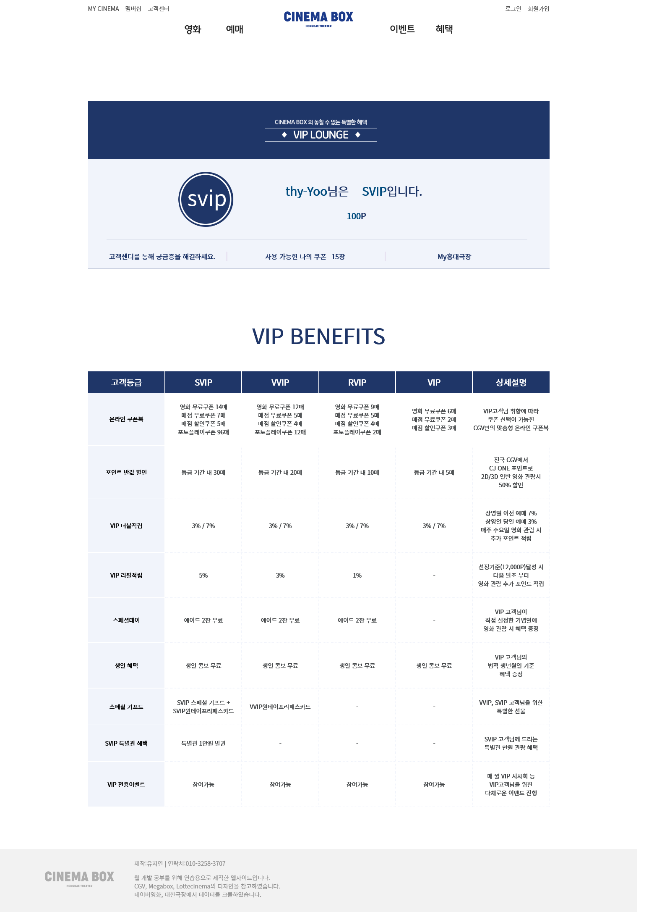
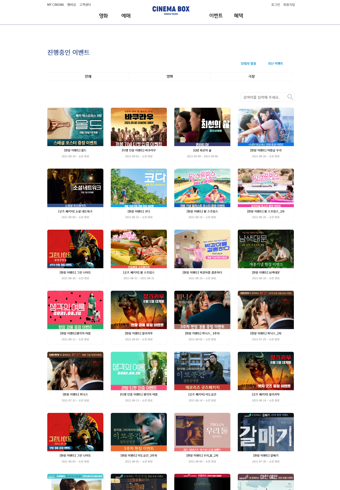

### 개인기록용

#### 기능 추가 1 - 상세 페이지에서 데이터 크롤링.
```java
/*
 * 이미지에 링크가 걸려있고, 이미지를 통해서 상세 페이지로 접속하는 구조이다. 
 * 기본 주소 : https://www.daehancinema.co.kr/Event/List?TYPE=EVENTTYPE02&PAGE_NO=1 
 * 상세 페이지 주소 : https://www.daehancinema.co.kr/Event/Detail?SEQ=4539 
 * html 개발자 도구로 확인한 a태그 주소 : <a href="Event/Detail?SEQ=4593">  */

Elements poster_a = doc.select("div.img_thumb > a");
poster_aLink=poster_a.get(j).getElementsByAttribute("href").attr("href"); //a태그의 href 속성 추출.
System.out.println(poster_aLink); // 추출된 데이터 확인 => Detail?SEQ=4593 => https:// ... Event/ 를 붙여야함을 확인.
Document doc_detail = Jsoup.connect("https://www.daehancinema.co.kr/Event/"+poster_aLink).get(); //상세 데이터를 크롤링할 주소 지정.
content = doc_detail.select("div.event_area img"); //데이터 추출
```
<br><br>
#### 기능 추가 2 - DB테이블의 컬럼값과 현재 날짜를 비교하여 state 나누기.
```java
/*
 * 대한극장의 이벤트기간은
 * 패턴 1 : 2021-03-04 ~ 2021-10-20 
 * 패턴 2 : 2021-03-04 ~ 소진 시
 * 패턴 3 : 2021-03-04 ~ 소진 완료   ... 이 세가지 형태이다.
 */
startdate=(vo.getTerm()).substring(0, 10); //문자열, 2021-03-05 까지 받아오는 구문.
startdate_date = dateFormat.parse(startdate); //Date형					
				
if(vo.getTerm().length()>=23) { //패턴 1일 경우
  enddate=(vo.getTerm()).substring(13, 23); //String형
  enddate_date = dateFormat.parse(enddate);//Date형
}else {
	enddate=null; //소진시, 소진 완료의 경우 이벤트가 끝나는 날짜는 없으므로 enddate에 null을 넣는다.
}
enddate_date = dateFormat.parse(enddate);//Date형
if((vo.getTerm()).contains("소진 시")) { //소진 시라는건 아직 진행중이므로 
  state = "진행중인 이벤트";
}else if((vo.getTerm()).contains("소진 완료")) { //소진 완료라는건 끝난 이벤트이므로
  state = "지난 이벤트";
}else {
	state = null; //이도 저도 아닌 예외가 있을 경우에는 state에 null을 넣는다.
}

if(state == null) { //패턴 2,3을 거른 후 => 패턴 1들에 대해서
	if((dateCompare(today,startdate_date))&&(dateCompare(enddate_date,today))) { // 오늘>=시작일&& 종료일>=오늘 이면, true&&true
	  state = "진행중인 이벤트"; 
	}else if(dateCompare(startdate_date,today)) { // 시작일>=오늘 => 아직 시작하지 않은 이벤트, 예정 이벤트페이지 같은게 없으므로
		=state = "진행중인 이벤트";
	}else {
	  state = "지난 이벤트";
  }
}
/* 
 * dateCompare 함수는 아래와 같이 만들어두었다. */
public boolean dateCompare(Date d1, Date d2){
	int compare = d1.compareTo(d2);
	if(compare>=0) {
		return true; // 날짜가 큰걸 true라고 하겠다.
	}else  {
		return false;
	}
}
```
#### 작업 예정
```sql
-- 진행중인 이벤트 페이지 / 지난 이벤트 페이지에서 데이터를 처음부터 나눠서 가져올 예정이다.
 String sql="SELECT * FROM event_main2 WHERE event_term = '진행중인 이벤트' ;
```
<br><br><br><br><br>

## 웹 페이지 결과물 <br><br>


***


