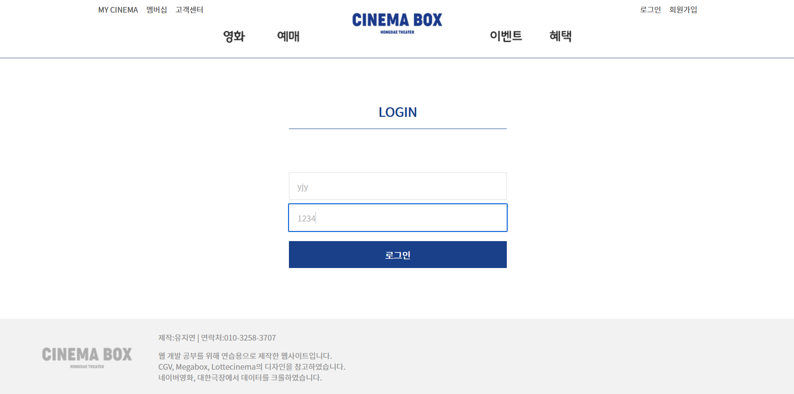
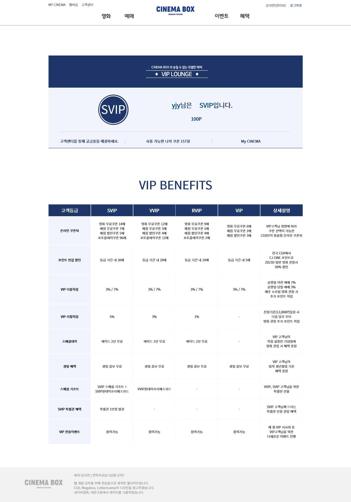
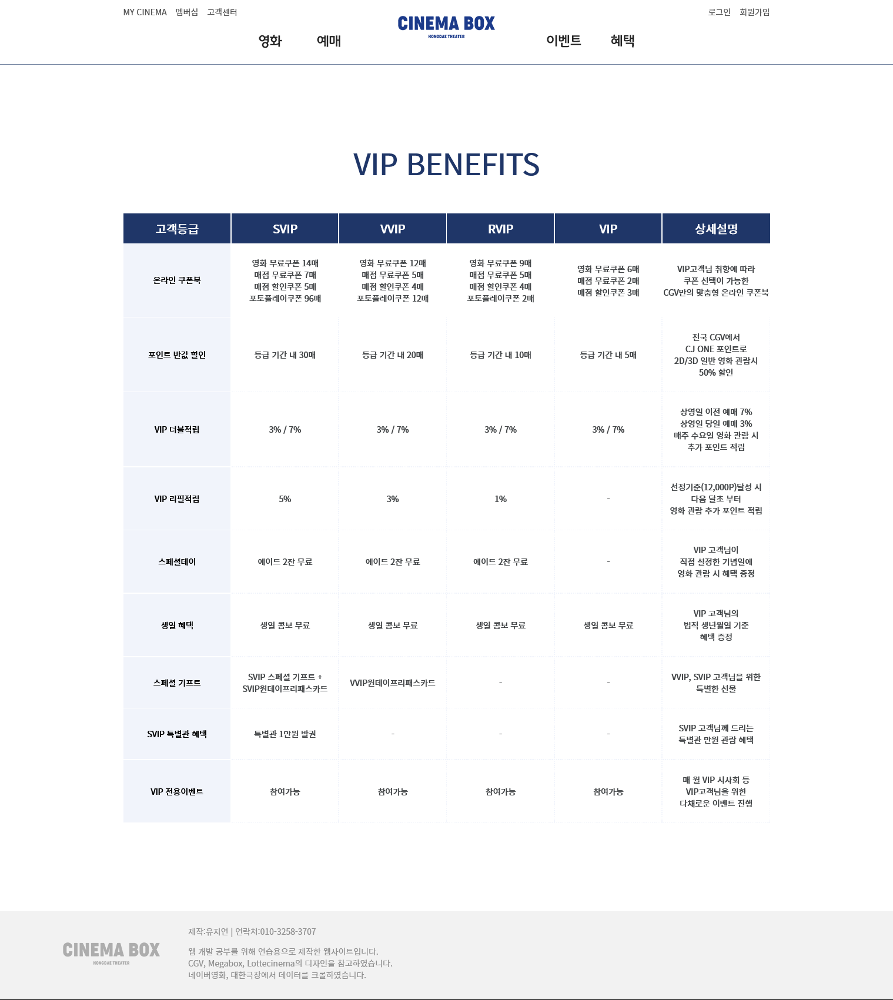

### 개인기록용
#### 기능 추가 1 - 로그인 기능
session 부분 작성할 것.
#### 기능 추가 2 - 회원DB가 업데이트 되면 유저의 vip혜택 정보를 담는 멤버십 테이블 데이터도 업데이트 되는 기능.
```java
 public ViploungeVO memberDataUpdate() {
  ViploungeVO vo = new ViploungeVO();
  try {
    getConnection();
    String sql= "INSERT INTO membership_benefit(userid) SELECT id FROM project_member "
    + "WHERE NOT EXISTS (SELECT userid FROM membership_benefit WHERE membership_benefit.userid = project_member.id)";
    /* 
     * membership_benefit table에 project_member id를 추가한다. (project_member table은 추후 회원가입 시 데이터가 들어갈 테이블임)
     * 단, 기존에 membership_benefit table에 같은 id정보가 존재할 경우, 가져오지 않는다.
     */
    ps=conn.prepareStatement(sql);
    ResultSet rs=ps.executeQuery();
    vo.setUserid(rs.getString(1));
    rs.next();
    rs.close();
  }catch (Exception ex) {
    ex.printStackTrace();
  }finally {
    disConnection();
  }
  return vo;
 }

```
<br><br>
#### 기능 추가 3 - session 데이터를 가져와서 페이지에 출력, 나누는 기능.
DAO, Model부분, jsp파일의 c:if 부분 작성할 것.

##### UserData를 Viplounge페이지에 뿌리는 기능 부분.
```java
 public ViploungeVO viploungeUserData(String idstr) { //string형 변수ID를 받아와서 (idstr)
  ViploungeVO vo=new ViploungeVO();
  try {
   getConnection();
   String sql="SELECT * FROM membership_benefit WHERE userid=?";//받아온ID와 table의 userid가 같은 행의 데이터를 뽑아온다.	
   ps=conn.prepareStatement(sql);
   ps.setString(1, idstr);
   ResultSet rs=ps.executeQuery();
   rs.next();
 
   vo.setMno(rs.getInt(1));
   vo.setUserid(rs.getString(2));
   vo.setUsergrade(rs.getString(3));
   vo.setTotal_point(rs.getInt(4));
   vo.setTotal_ticketnums(rs.getInt(5));
   rs.close();
  
  }catch(Exception ex) {
   ex.printStackTrace();
  }finally {
   disConnection();
  }
  return vo;
 }
```

<br><br><br><br>
## 웹 페이지 결과물
__로그인 페이지__ <br><br>
 
 <br><br><br><br>
 
__로그인 상태 : 유저 멤버쉽 데이터를 출력하는 Viplounge 페이지__ <br><br>
  
  <br><br><br><br>

__비 로그인 상태 : 기본 Viplounge 페이지__ <br><br>
  
